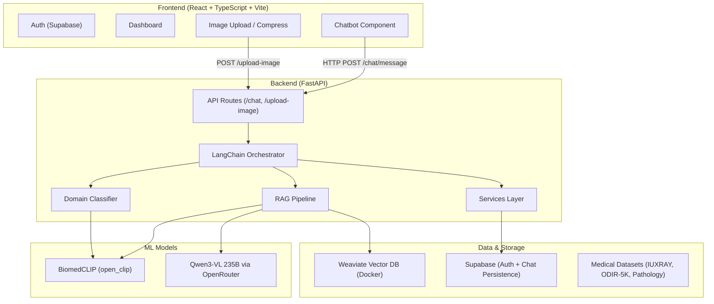
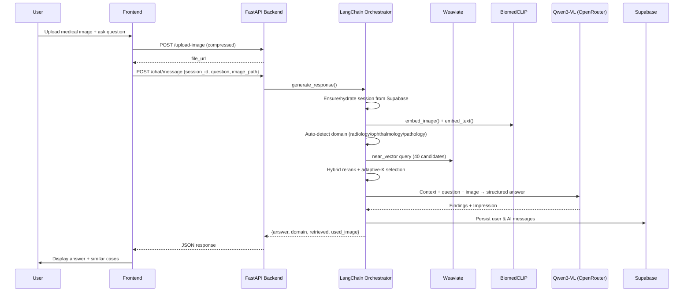

# MED-RAG - Multimodal Medical RAG System 

A **Medical Retrieval-Augmented Generation (RAG)** system supporting three clinical imaging domains: **Radiology**, **Ophthalmology**, and **Pathology**. It combines MedCLIP vision-language embeddings, Weaviate vector search, and a Qwen3.5-VL large multimodal model to answer medical image questions.

---

## High-Level Architecture



---

## Directory Structure

| Path | Purpose |
|------|---------|
| `run_project.py` | One-command launcher: starts Weaviate (Docker), FastAPI backend (:8000), Vite frontend (:5173) |
| `backend/app/` | FastAPI application |
| `frontend/src/` | React TypeScript UI |
| `scripts/` | Data ingestion, evaluation, and tuning utilities |
| `data/` | Medical datasets (3 domains) |
| `models/` | Local model checkpoints (BiomedCLIP, retriever) |
| `cache/` | Cached embeddings from ingestion |
| `docker-compose.yml` | Weaviate container definition |

---

## Backend Deep Dive

### Entry Point — `backend/app/main.py`

- Creates a **FastAPI** app with CORS (allowing `localhost:5173`)
- Mounts `/uploads` as a static file directory for uploaded medical images
- Provides a `POST /upload-image` endpoint that saves images with UUID filenames
- Includes routers from `api/chat.py` (under `/chat`) and `api/inference.py` (under `/api`)

### API Layer — `backend/app/api/chat.py`

| Endpoint | Method | Purpose |
|----------|--------|---------|
| `/chat/message` | POST | Send a question (+ optional image & domain) → get RAG answer |
| `/chat/sessions` | POST | Create a new chat session |
| `/chat/sessions/{user_id}` | GET | List all sessions for a user |
| `/chat/sessions/{session_id}` | DELETE | Delete a session |
| `/chat/history/{session_id}` | GET | Retrieve chat history |
| `/chat/reset` | POST | Reset session memory |
| `/chat/prime` | POST | Silently prime a session with an image (pre-analyze) |

### Core — RAG Pipeline (`backend/app/core/rag_pipeline.py`)

The heart of the system. Key operations:

1. **Embedding** — Uses `BiomedCLIP-PubMedBERT_256-vit_base_patch16_224` via `open_clip` to encode query images/text into 512-dim vectors (L2-normalized)
2. **Retrieval** — Queries Weaviate `MedicalReport` class with `near_vector`, fetching up to `MAX_CANDIDATES=40` candidates
3. **Hybrid Reranking** — Scores each candidate as a weighted combination of:
   - Weaviate certainty score
   - Cosine similarity of text embeddings
   - Cosine similarity of image embeddings
4. **Adaptive-K Selection** — Keeps top candidates above `SIM_THRESHOLD=0.75`, with at minimum `MIN_K=3` results
5. **LLM Generation** — Sends retrieved context + user question + (optional) image to **Qwen3-VL 235B** via OpenRouter API, producing structured medical findings

### Core — LangChain Orchestrator (`backend/app/core/langchain_orchestrator.py`, 692 lines)

Wraps the RAG pipeline with conversational capabilities:

- **Session memory** — Uses `ConversationBufferMemory` per session
- **History persistence** — Hydrates memory from Supabase on re-connect
- **Image handling** — Resolves images from URLs or local paths, caches remote downloads, converts to data URLs for vision model
- **Domain detection** — Auto-classifies images into radiology/ophthalmology/pathology using prototype embeddings
- **Initial summary** — Generates an automatic analysis when an image is first uploaded (silent "prime" mode)
- **Context formatting** — Builds rich context strings from retrieved medical records
- **Clarification detection** — Identifies when queries are too vague and prompts for clarification

### Core — Supporting Modules

| File | Purpose |
|------|---------|
| `backend/app/core/rag_utils.py` | Shared BiomedCLIP model loading (`embed_image`, `embed_text`) with lazy initialization |
| `backend/app/core/domain_classifier.py` | Classifies images by cosine similarity to domain prototype embeddings |
| `backend/app/core/weaviate_schema.py` | Creates the `MedicalReport` Weaviate class |

### Weaviate Schema — `MedicalReport`

```
Properties:
  - patient_id     (string)
  - domain         (string)   — "radiology" | "ophthalmology" | "pathology"
  - eye            (string)   — for ophthalmology (left/right)
  - image_path     (string)
  - report_text    (text)
  - label          (string)
  - image_embedding  (number[])
  - text_embedding   (number[])
```

### Services Layer

| File | Purpose |
|------|---------|
| `backend/app/services/supabase_client.py` | Cached Supabase client using service-role key |
| `backend/app/services/chat_repository.py` | CRUD for `chat_sessions` and `chat_messages` tables in Supabase |
| `backend/app/services/chat_storage.py` | Uploads chat attachments to Supabase Storage bucket |

---

## Frontend Deep Dive

Built with **React + TypeScript + Vite**, styled with Tailwind CSS, using **Supabase Auth** for user authentication.

### Components

| Component | File | Purpose |
|-----------|------|---------|
| App | `frontend/src/App.tsx` | Root component — shows Auth or Dashboard based on login state |
| Auth | `frontend/src/components/Auth.tsx` | Login/signup form using Supabase Auth |
| Dashboard | `frontend/src/components/Dashboard.tsx` | Main layout containing the Chatbot |
| **Chatbot** | `frontend/src/components/Chatbot.tsx` | Full-featured chat UI (887 lines) — the main interaction point |
| ImageList | `frontend/src/components/ImageList.tsx` | Displays retrieved similar images from the RAG pipeline |
| ImageUpload | `frontend/src/components/ImageUpload.tsx` | Image upload with drag-and-drop and compression |

### Chatbot Features (main UI component)

- **Session management** — Create, list, switch, and delete chat sessions
- **Image upload** — Drag-and-drop or file picker with client-side compression (WebP, quality 0.65)
- **Message flow** — Sends question + image to `POST /chat/message`, displays AI response with retrieved cases
- **Domain info display** — Shows detected domain, confidence, and classification details
- **History persistence** — Loads previous conversations from Supabase via the backend

### Key Libraries

| Library | Purpose |
|---------|---------|
| `frontend/src/lib/api.ts` | Wrapper around `fetch()` pointing to `http://localhost:8000` |
| `frontend/src/lib/supabase.ts` | Supabase client for frontend auth |
| `frontend/src/contexts/AuthContext.tsx` | React context providing user auth state |

---

## Scripts & Tooling

### Data Ingestion — `scripts/ingest_data.py` (497 lines)

Processes medical datasets and loads them into Weaviate:

1. Reads CSV metadata (patient IDs, labels, reports)
2. Loads images and computes BiomedCLIP image embeddings
3. Computes text embeddings from report text
4. L2-normalizes all embeddings
5. Batch-uploads to Weaviate with deduplication checks
6. Supports domain-specific logic:
   - **Radiology**: Single chest X-ray + report text
   - **Ophthalmology**: Paired left/right fundus images + diagnostic codes (N/G/C/A/D/M/O)
   - **Pathology**: Single histology slide + metadata
7. Caches embeddings to `cache/` directory for re-runs

### Evaluation — `scripts/eval_metrics.py` (577 lines)

Comprehensive evaluation suite:

| Metric | Description |
|--------|-------------|
| **Precision@K** | Fraction of retrieved items that are relevant |
| **Recall@K** | Fraction of relevant items that are retrieved |
| **BLEU** | Via `sacrebleu` — measures n-gram overlap with reference |
| **ROUGE-L** | Via `rouge_score` — longest common subsequence overlap |
| **Hallucination Rate** | Via NLI entailment — measures unsupported claims |
| **MedFactScore** | Aggregate entailment score across extracted sentences |

### Other Scripts

| Script | Purpose |
|--------|---------|
| `scripts/tune_retrieval.py` | Hyperparameter tuning for retrieval (alpha, thresholds) |
| `scripts/split_dataset.py` | Train/test split for radiology data |
| `scripts/split_odir.py` | Train/test split for ODIR-5K ophthalmology data |
| `scripts/split_pathology.py` | Train/test split for pathology data |
| `scripts/generate_predictions.py` | Batch prediction generation for evaluation |
| `scripts/convert_pathology_csv.py` | Converts raw pathology data to standard CSV format |

---

## Data & Datasets

> [!IMPORTANT]
> The `data/` directory is **not included** in this repository due to its large size. You must download the datasets manually and place them in the `data/` folder before running the ingestion scripts.

### Required Datasets

| Domain | Directory | Dataset | Source |
|--------|-----------|---------|--------|
| **Radiology** | `data/IUXRAY/` | Indiana University Chest X-Ray Collection | [OpenI — NLM](https://openi.nlm.nih.gov/faq#collection) |
| **Ophthalmology** | `data/ODIR-5K/` | ODIR-5K (Ocular Disease Intelligent Recognition) | [Kaggle — ODIR-5K](https://www.kaggle.com/datasets/andrewmvd/ocular-disease-recognition-odir5k) |
| **Pathology** | `data/pathology/` | PathVQA — Pathology Visual Question Answering | [Hugging Face — PathVQA](https://huggingface.co/datasets/flaviagiammarino/path-vqa) |

### Expected Folder Structure

After downloading, your `data/` directory should look like this:

```
data/
├── IUXRAY/
│   ├── images/                          # Chest X-ray images (.png)
│   ├── indiana_reports.csv              # Original radiology reports
│   ├── indiana_projections.csv          # Image projection metadata
│   └── indiana_merged_cleaned.csv       # Merged & cleaned dataset
├── ODIR-5K/
│   ├── images/                          # Fundus photographs (.jpg)
│   └── full_df.csv                      # Patient metadata & diagnostic labels
├── pathology/
│   ├── train/                           # Histology slide images
│   ├── trainrenamed.csv                 # Training metadata
│   └── answers.txt                      # VQA answer labels
└── weaviate/                            # Auto-generated by Weaviate (Docker volume)
```

### Dataset Setup

1. Download each dataset from the sources listed above
2. Place the files in the corresponding directories under `data/`
3. Run the ingestion script to process and load data into Weaviate:
   ```bash
   python scripts/ingest_data.py
   ```
   This will compute BiomedCLIP embeddings, cache them in `cache/`, and upload records to Weaviate.

### Train/Test Splits

The project includes scripts to generate train/test/val splits for each domain:

```bash
python scripts/split_dataset.py      # Radiology (IUXRAY)
python scripts/split_odir.py         # Ophthalmology (ODIR-5K)
python scripts/split_pathology.py    # Pathology
```

These will create `*_train.csv`, `*_test.csv`, and `*_val.csv` files within each dataset directory.

---

## External Services & Configuration

| Service | Purpose | Config Key |
|---------|---------|-----------|
| **Weaviate** | Vector database (self-hosted via Docker on `:8080`) | `WEAVIATE_URL` |
| **OpenRouter** | LLM API gateway to Qwen3-VL 235B | `OPENROUTER_API_KEY` |
| **Supabase** | User authentication + chat history persistence | `SUPABASE_URL`, `SUPABASE_SERVICE_ROLE_KEY` |
| **HuggingFace** | Model downloads (BiomedCLIP) | `HUGGINGFACE_TOKEN` |

---

## How It All Fits Together



---

## How to Run

```bash
# 1. Install Python deps
pip install -r requirements.txt

# 2. Install frontend deps
cd frontend && npm install && cd ..

# 3. Start everything (Weaviate + Backend + Frontend)
python run_project.py
```

- **Backend**: http://localhost:8000
- **Frontend**: http://localhost:5173
- Press `Ctrl+C` to stop all services
